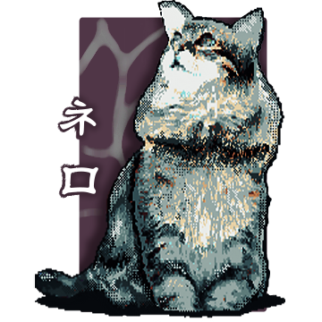
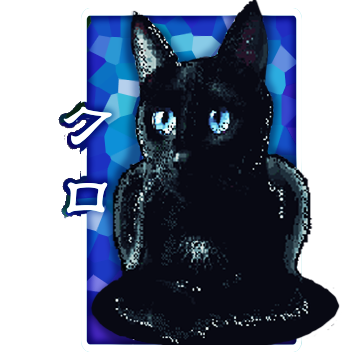
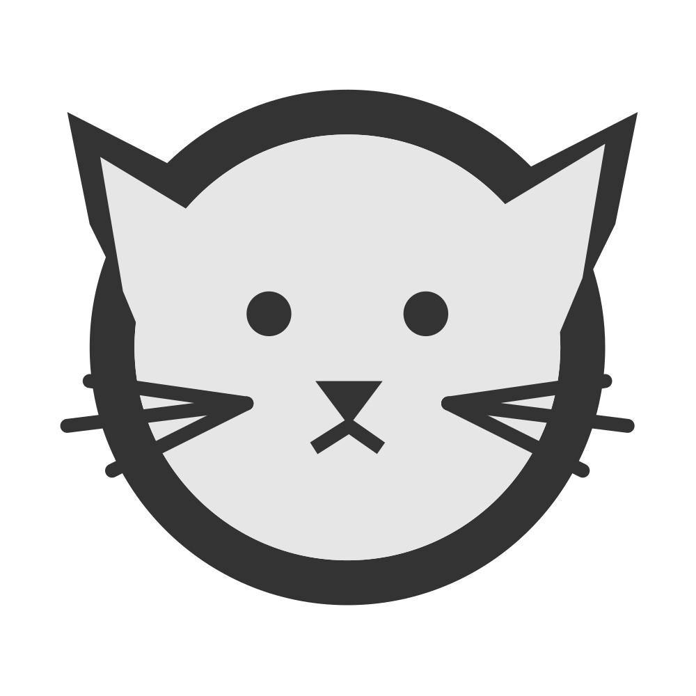
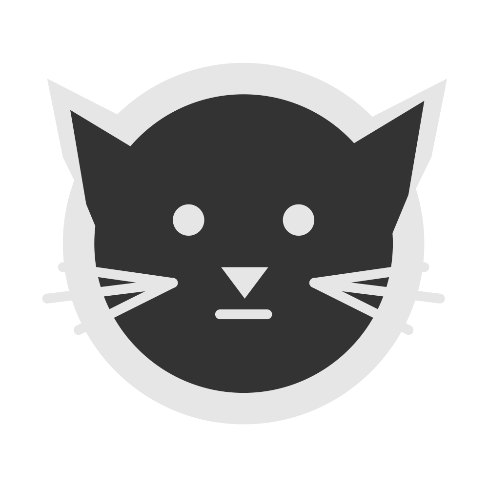
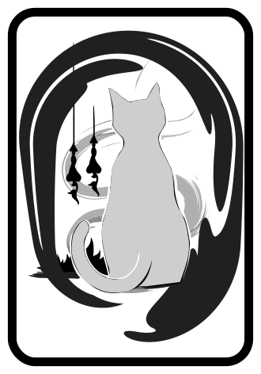
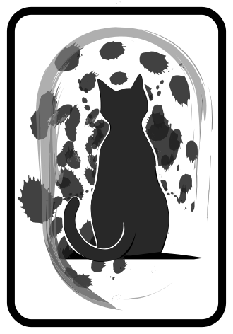

___
# Nft | F24 Project

This Project is a section of **Cyfrin Solidity Course**.  

It was build to learn and understand foundry under the guidance of  **Patrick Collins**, <small>(*Smart Contract Engineer*, *Auditor* and *Educator*) </small>  
For more information, visit [Cyfrin Solidity Course](https://github.com/Cyfrin/foundry-full-course-f23) or 
*[Lesson 11: Foundry Nft](https://www.youtube.com/watch?v=sas02qSFZ74&t=0s)* for enlightment  

<big>**Table of Contents**</big>
- [Nft | F24 Project](#nft--f24-project)
- [Introduction](#introduction)
  - [CATZI Nft Collection](#catzi-nft-collection)
- [Getting Started](#getting-started)
  - [Requirements](#requirements)
- [Usage](#usage)
  - [Deploy](#deploy)
  - [Testing](#testing)
    - [Test Coverage](#test-coverage)
- [Deploying to a testnet or mainnet](#deploying-to-a-testnet-or-mainnet)
  - [Image URI](#image-uri)
  - [Estimate gas](#estimate-gas)
  - [Minting Nft](#minting-nft)
- [Thank you!](#thank-you)
  

# Introduction
Welcome to **LocalToken | Foundry 24** This is an educational project designed to explore the intricacies of blockchain technology and smart contract development. Created as a learning experiment, both `Nft` and `DNft` adheres to the ERC721 standard in [`Foundry`](https://book.getfoundry.sh/), a powerful tool for developing smart contracts.
we go through creating 2 different kinds of NFTs.

1. An IPFS Hosted NFT 
2. An SVG NFT (Hosted 100% on-chain) 

The README provides detailed instructions for getting started, deploying, testing, and interacting with smart contracts on various networks. This hands-on project is a great opportunity to master Foundry and its applications in real-world scenarios as part of the **Cyfrin Solidity Course**.


## CATZI Nft Collection
<div align="center">
    <h3>BASIC NFT COLLECTION</h3>
    
    
    <h3>DYNAMIC NFT COLLECTION ( ON CHAIN )</h3>
    
    
    <h3>DYNAMIC NFT COLLECTION ( BONUS )</h3>
    
    
</div>


# Getting Started

## Requirements

- [git](https://git-scm.com/book/en/v2/Getting-Started-Installing-Git)
  - run `git --version` in the terminal and you see a response like `git version x.x.x` you have git installed. else, click on git to get full on instructions.
- [foundry](https://getfoundry.sh/)
  - similarly run `forge --version` and if you see a response like `forge 0.2.0 (816e00b 2023-03-16T00:05:26.396218Z)` yo got foundry down. else, click on foundry.
  

# Usage

## Deploy
In order to deploy the `Nft` contract, we deploy the script that we created by runing the following command:

```
forge script script/Deploy__Nft.s.sol
```

to deploy the `DNft` contract, we deploy the script that we created by runing the following command:

```
forge script script/Deploy__DNft.s.sol
```
or you can use the following command if you are using included `Makefile`.
>**note:** to display all shorcuts in the `Makefile` you can use `make help` command.

```
make deploy-nft
```
to deploy Nft contract and

```
make deploy-dnft    
```
to deploy DNft contract


## Testing

In this project we cover the following testing strategies:
1. Unit
2. Integration

foundry has a built in test runner that we can use to run our tests. which can be done using the following command:
- to run all tests
 ```
 forge test
 ```

- to run a specific test

 ```
 forge test --match-test testFunctionName
 ```
dont forget to add `test` at the beginning of the test function name.like for example
```
function testFunctionName() public {}

function test_functionName() public {}
```
both ways works.

to run the test in a diffrent network, we can use the following command:

```
forge test --fork-url $SEPOLIA_RPC_URL
```
>**note :** we are conducting tests in a sepollia test network. and `$SEPOLIA_RPC_URL` is an environment variable that we set in the `.env` file which contains the url of the sepollia test network.

### Test Coverage
this is more like a grading for our contract and we can run the command to check coverage.

```
forge coverage
```
we run it see how much the tests we done is 'enough' but (0 % is bad).

additionally, we can use the following command to get a report on the coverage. which will be useful to write test for the contract.

```
forge coverage --report debug > coverage.txt
```
# Deploying to a testnet or mainnet

1. Seting up environment variables

    set up your `SEPOLIA_RPC_URL` and `PRIVATE_KEY` as environment variables. You can add them to a `.env` file in the root of the project. for example:

    ```
    SEPOLIA_RPC_URL=https://eth-mainnet.alchemyapi.io/v2/your-api-key
    PRIVATE_KEY=your-private-key
    ```

 - `PRIVATE_KEY`: The private key of your account (like from [metamask](https://metamask.io/)).  
    >**note :** dont be a dum_dum, please create a test account with test ETH and use it.

 - `SEPOLIA_RPC_URL`: This is url of the sepolia testnet node you're working with. You can get setup with one for free from [Alchemy](https://alchemy.com/?a=673c802981)

    Optionally : add your `ETHERSCAN_API_KEY` if you want to verify and interact with your contract on [Etherscan](https://etherscan.io/).


2. Get testnet ETH

    go to [faucets.chain.link](https://faucets.chain.link/) and get some testnet ETH. You should see the ETH show up in your metamask account. if you are having difficulty in metamask watch this vedio from [Patrick Collins](https://youtu.be/umepbfKp5rI?si=41JtvTgEIsXD9u2N).  
    >dont be like mr crabs and hoard test ETH, use them sparingly.

3. Deploy
   
    here we deploy the `Nft` contract to a sepolia testnet by running the command:

    ```
    forge script script/Deploy__Nft.s.sol --rpc-url $SEPOLIA_RPC_URL --private-key $PRIVATE_KEY --broadcast --verify --etherscan-api-key $ETHERSCAN_API_KEY
    ```
    and the `DNft` contract by running the command:

    ```
    forge script script/Deploy__DNft.s.sol --rpc-url $SEPOLIA_RPC_URL --private-key $PRIVATE_KEY --broadcast --verify --etherscan-api-key $ETHERSCAN_API_KEY
    ```
    >you could run their make alternatives provided in the `Makefile`

    I dont advice you to run the DNft contract as it costs too much gas to deploy. a funny truth that i encounterd while trying to mint KURO.svg on chain is that the gas costs is more than 2 billion USD.
    which is why decentralized storages exist


## Image URI

To get the URI of an image, you can use the following command:

```
echo "data:image/svg+xml;base64,$(base64 -i assets/svg/NERO_B.svg)"
```

Then, you can get the URI of the metadata by placing the imageURI into `NERO_B.json` then running:

```
echo "data:application/json;base64,$(base64 -i assets/metadata/NERO_B.json)"
```
> `NERO_B.json` isnt provided as we made it in the contract.


## Estimate gas

You can estimate how much gas things cost by running:

```
forge snapshot
```

And you'll see an output file called `.gas-snapshot` in your project directory.

## Minting Nft

to mint the Nft to contract run

```
make mint
```
and for minting DNft run 
```
make mint-dnft
```

to run it on the testnet pass `ARGS="--netwok sepolia"`


# Thank you!
peace and blessing be upon you friend.
I would take this opportunity to sing praises to my mentor but i want you to see it for you self.
If you appreciated this project,dont give me any credits. all i want you to do is to check out sir Patrick Collins foundry course f23.

link to his bio  

[](https://twitter.com/PatrickAlphaC)
[](https://www.youtube.com/channel/UCn-3f8tw_E1jZvhuHatROwA)